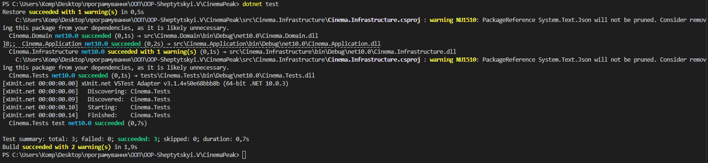

# Ітерація №3 (Lab 36) 

### 1. Результати автоматизованого тестування
- **Кількість тестів:** 3 (Unit tests для сутностей та логіки).
- **Статус:** Усі тести пройдені успішно (Passed).
- **Інструментарій:** xUnit framework.

### 2. Виконані технічні завдання
- **Тестованість:** Проведено рефакторинг моделей, додано метод `ToString()` для коректного відображення об'єктів.
- **DIP (Dependency Inversion):** Тести підключені до Core-проєктів через посилання, що дозволяє перевіряти логіку незалежно від UI.
- **Fault Handling:** Перевірено стабільність збірки при наявності попереджень (warnings) NuGet.

### 3. Скріншот успішних тестів

