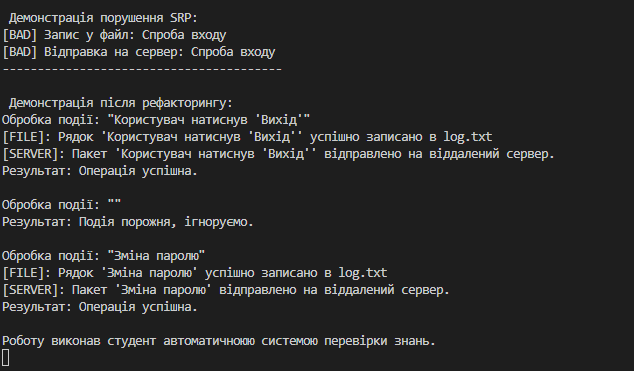

# Виконано рефакторинг UserActivityLogger згідно з принципом SRP

- Розділено функціонал на окремі класи: Filter, FileLogger, ServerLogger.
- Впроваджено інтерфейси для дотримання принципу DIP.
- Додано UML-схему розподілу відповідальностей.

