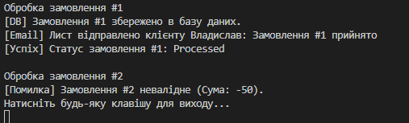

# Лабораторна робота №20

## Виконані завдання
1. **Аналіз проблеми:** Початковий клас `OrderProcessor` порушував SRP, оскільки поєднував у собі валідацію, роботу з БД, відправку повідомлень та зміну статусів.
2. **Рефакторинг:** Функціонал розподілено між окремими сервісами:
   - `IOrderValidator` — логіка перевірки даних.
   - `IOrderRepository` — збереження у сховище.
   - `IEmailService` — сповіщення клієнтів.
3. **Впровадження залежностей (DI):** Створено клас `OrderService`, який координує роботу через інтерфейси, що робить систему гнучкою до змін.

