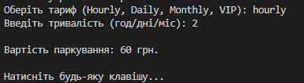
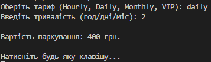
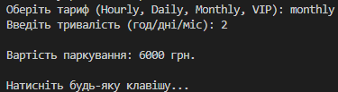
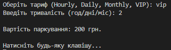

# Лабораторна робота №21

**Strategy Pattern** 
    Створено стратегії для **Hourly**, **Daily** та **Monthly** оплати. Кожна стратегія містить власну логіку знижок (наприклад, ціна знижується після 5-ї години або 7-го дня).
**Factory Method** 
    Реалізовано фабрику, яка дозволяє динамічно обирати потрібний тариф за його назвою, повністю приховуючи логіку ініціалізації від клієнта.
**Демонстрація OCP** 
    Додано нову стратегію `VIPParkingStrategy` (з фіксованим внеском). Додавання відбулося **без модифікації** існуючого класу `ParkingService`, що доводить стійкість архітектури до змін.

---

# Скріни роботи

### Hourly 

### Daily 

### Monthly

### VIP 

