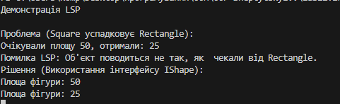

Висновок
Баг: Квадрат ламає логіку прямокутника, коли автоматично міняє висоту разом із шириною. Це порушує LSP.

Фікс: Розділив їх через інтерфейс IShape.

Підсумок: Якщо ми міняємо одну деталь на іншу, логіка програми не має ламатися.

