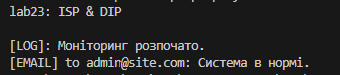

# Лабораторна робота №23: Принципи ISP та DIP

## Аналіз:
1. **DIP (Dependency Inversion Principle):** Клас `OldSystemMonitor` сам створював об'єкт `Logger`. Якщо я захочу змінити Logger на інший, доведеться переписувати сам монітор.
2. **ISP (Interface Segregation Principle):** Інтерфейс `ISystemTask` був занадто великим. Класи змушені були б реалізувати методи для логування, імейлів та звітів одночасно, навіть якщо їм потрібен лише один.

## Що змінено:
1. **ISP:** Розділив великий інтерфейс на три маленькі: `ILogger`, `INotifier`, `IReporter`.
2. **DIP:** Клас `SystemMonitor` тепер приймає інтерфейси через конструктор. Він не знає, *як* саме працює логер, він просто його використовує.

## Висновок:
Завдяки DIP код став гнучким (можна легко підставити будь-який логер). Завдяки ISP класи не перевантажені зайвими методами.

