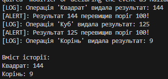

# Лабораторна робота №24: Numeric Processing System

## Реалізовані патерни
- **Strategy (Стратегія):** дозволяє динамічно змінювати математичний алгоритм обробки числа.
- **Observer (Спостерігач):** використовує події (`event`), щоб сповіщати різні частини системи про готовність результату.

## Функціонал
- Обчислення квадрата, куба та кореня.
- Логування в консоль та збереження історії.
- Автоматичне сповіщення (Alert), якщо результат перевищує заданий поріг.

