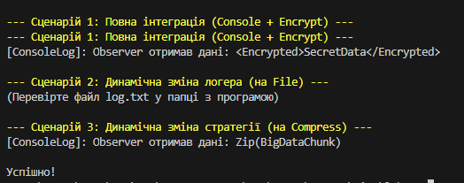

## Лабораторна робота №25: Integrated Design Patterns System

## Реалізовані патерни
- * Singleton (LoggerManager): Гарантує єдину точку доступу до системи логування.
- * Factory Method (LoggerFactory): Абстрагує процес створення об'єктів логування (Console/File).
- * Strategy (IDataProcessorStrategy): Дозволяє динамічно змінювати алгоритм обробки даних (Encrypt/Compress).
- * Observer (DataPublisher): Використовує події для автоматичного сповіщення про завершення обробки.
## Функціонал
- * Note - Проєкт демонструє взаємодію декількох паттернів в одній екосистемі для забезпечення гнучкості архітектури.
- * Динамічне логування: Зміна виводу з консолі у файл log.txt без переписування логіки клієнта.
- * Гнучка обробка: Можливість зміни стратегії обробки даних (шифрування або стиснення) під час виконання.
- * Автоматизоване сповіщення: Логування результату відбувається автоматично завдяки підписці Observer на подію DataProcessed.

## Сценарії демонстрації
Сценарій 1: Повна інтеграція (Console Logger + Encrypt Strategy).

Сценарій 2: Динамічна зміна логера на файловий (FileLogger).

Сценарій 3: Динамічна зміна стратегії на стиснення (CompressData).

