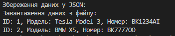

# Лабораторна №28: JSON-серіалізація

Мета:

Реалізація збереження даних про транспорт (Vehicle, Route) у форматі JSON з використанням бібліотеки System.Text.Json.

# Технічні особливості

Repository Pattern: Логіка управління даними винесена в окремий клас VehicleRepository.

Асинхронність: Методи SaveToFileAsync та LoadFromFileAsync для стабільної роботи з файловою системою.

Форматування: JSON зберігається у зручному для читання вигляді (WriteIndented).

