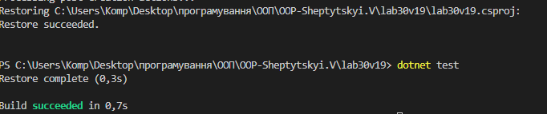

# Лабораторна робота №30

Що було зроблено:

Реалізовано логіку LoanCalculator (розрахунок кредиту).

Написано 10 тестів, використовуючи [Fact] для базових перевірок та [Theory] з [InlineData] для тестування цілих наборів значень.

Опрацьовано виняткові ситуації (Assert.Throws) та перевірено точність математичних розрахунків.

