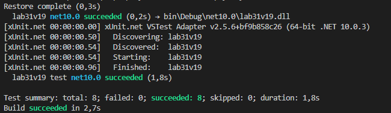

# Лабораторна робота №31
У цій роботі я опанував інструмент **Moq** для створення імітацій (mock-об'єктів). 
На практиці було реалізовано 8 тестів, які дозволили перевірити логіку `SearchService` без використання реальних сервісів. 
Я навчився використовувати:
* `.Setup()` для визначення поведінки залежностей;
* `.Verify()` для контролю кількості та правильності викликів методів;
* Dependency Injection для передачі Mock-об'єктів у тестований сервіс.

